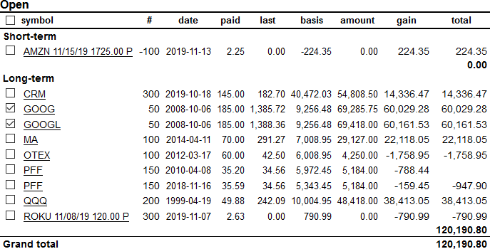

Stock Portfolio Tracker
=======================

This web-based app keeps track of U.S. stocks in a portfolio of
brokerage accounts.  Accounts holding mutual funds are supported too, as long
as quotes for those mutual funds can be retrieved via their symbols (e.g.,
`FSMAX`).

This work started as support software for an investment club but was soon
changed to maintain the developers' stock portfolios.  While the
software has been used for many years, much more work is needed to make it
useful for the general investment public.  Posting issues is encouraged.

Most common stock transactions are supported such as short-selling, writing
options, stock splits and spin-offs, cash-in-lieu of fractional shares,
dividends, return of capital, etc.  More esoteric transactions may require some
creativity to make them fit the provided transaction types.

The import scripts treat fees as negative dividends to reflect the impact on
the performance of the stock or mutual fund.  In mutual funds, such fees are
usually covered by reducing the number of shares held.  In such cases, import
scripts create two transactions, a negative dividend followed by a sale of the
appropriate number of shares.  Cash-in-lieu of fractional shares is also
expressed as a sale.

Usage
-----

First, enter or import equity transactions for one or more accounts into
text files under the directory `portfolioapi/data`.  See below for the data format
([samples](./tests/data/account2)).

Stock quotes may be retrieved from a financial service by accessing the URL
`/retrieve-quotes`.  Alternatively, stock quotes may be imported from Quicken CSV or
QIF files.

Flask may run the app locally.  After installing Flask, run this command in a bash
Terminal:

    FLASK_APP=portfolioapi flask run

In Windows, set the environment variable `FLASK_APP=portfolioapi` and
run the previous command in a Command Prompt or Powershell.

Next, open the following page in a web browser:
`http://127.0.0.1:5000/static/report.html`

If you have access to a web server running Apache, you can configure
[mod_wsgi](https://modwsgi.readthedocs.io/) using the [sample
configuration](./sample-mod_wsgi.conf).

While you can access the pages as
`https://server/portfolioapi/static/report.html`, it is preferable to have
Apache serve the static pages.  That requires configuring Apache to serve the
content of [portfolioapi/static](./portfolioapi/static), maybe after copying it
elsewhere.  The file [api-url.js](./portfolioapi/static/js/api-url.js) needs to
be edited.  For the sample configuration, it should have this content:

    export const api_url_prefix = '/portfolioapi/';

Displays
--------

HTML files take parameters via the query string.  Many of the parameters are
shared:

* `account`: The nickname of the account.  Special names are `all` for a
  sequence of all accounts and `combined` for combining the holdings of all
  accounts.

* `date`: The date, in ISO format, of the portfolio to be displayed.  The
  default is the current date.

* `year`: The year for which the information such as tax liability should be
  displayed.  This may be interpreted as the last day of that year.  The
  default is the current year.

* `start`, `end`: The start and end dates, for example, for a chart.  The
  defaults are `1970-01-01` and the current date, respectively.

There are multiple HTML files:

* `report.html`: The main portfolio display shows the account holdings; one row
  per equity. The row displays information such as the number of shares,
  the holding duration, the last closing price, the overall value, the
  cumulative dividends, and the percentage gain.  For options, the time value
  is shown, too.  Clicking on a column heading sorts by that column.  Clicking
  on the `+` column expands multiple lots of the same equity.

  

* `taxes.html`: This shows the realized taxable gain or loss for the
  selected account and year.  Open positions are shown, too. Checkboxes for
  these open positions show the tax liability if the position would be closed
  now.

  

* `options.html`: This shows a long-term view of the profitability of option
  trades grouped by the underlying stock symbol.

  

* `annual.html`: This shows a multi-year view of an account with the deposits,
  equity and cash values for each year.  In addition, the annualized gain is
  shown for 1, 3, 5, and 10 years compared against `SPY` - the ETF tracking the
  S&P 500.

* `chart.html`: This shows a chart tracking the account value over the selected
  date interval.  A faint line indicates the cumulative deposits into that account.

Data Files
----------

By default, all data files are stored in the subdirectories `data`, `cache`,
and `quotes` of the directory [portfolioapi](./portfolio/).  Other than the
`data` directory, those directories are created automatically if they do not
exist.  If those directories should be elsewhere, it is easiest to symlink to
the desired location.  Otherwise, variables at the top of
[portfolio.py](./portfolioapi/portfolio.py) and
[stockquotes.py](./portfolioapi/stockquotes.py) may be changed.  Other than the
`data` directory, the directories need to be writable by the user ID running
the web server.

The transactions of each brokerage account are described in a text file in the
`data` directory using the nickname for the account (without a file
extension).  The [format of those files](./doc/account.md) uses vertical bars
as separators.  Examples can be found among the [tests](./tests/data/account2).

    1998-12-21|d|Deposit|278000
    1999-04-19|b|QQQ|100|99.75|29.95
    2000-03-20|x|QQQ|1

To track changes in equity values, stock quotes for the holdings have to be
retrieved, ideally on a daily basis.  The URI `/retrieve-quotes` retrieves
quotes for all holdings and stores them in a file named `<iso-date>.csv` in the
`quotes` directory.  In addition, the quotes are stored in an SQLite database
(default: `cache/quotes.db`).  After making changes to the text files
containing stock quotes, the database needs to be re-populated by accessing
`/update-quotes`.

Historical charts are powered with data stored in SQLite databases in the `cache`
directory.  If retroactive changes are made to an account text file, the
corresponding database has to be cleared by accessing
`/clear-history?account=xyz`.

Import from Brokerage Accounts
------------------------------

Brokerage companies may offer the means to download transactions in CSV
format.  Various scripts in [ingest](./ingest) can convert those files at least
partially to the required format.

Stock Quotes
------------

To maintain daily stock quotes for all holdings, the URI `/retrieve-quotes`
should be accessed each weekday afternoon.  As the web site providing the
quotes may not always be available, this may be done multiple times.  If a
quote file for the day already exists, nothing will happen unless the parameter
`?force=true` is added.  End-of-day quotes may be requested 30 mins or so after
the stock market closes at 4pm Eastern.  If there are mutual funds among the
holdings, request quotes after 6pm Eastern.

On a Linux server or Mac, add a cron job entry like the following (shown as Pacific Time):

    0,30 15-16 * * 1-5 curl -s -n http://localhost/portfolioapi/retrieve-quotes > /dev/null

Updating Databases
------------------

Databases are used to store stock quotes and account histories.  There are
several URLs that update databases.

* `/retrieve-quotes`: Accesses a financial service to retrieve end-of-day stock
  quotes for the current holdings.  For example, load this url after more transactions
  are entered. As the quotes are retrieved only once per day, they can be forced
  to run again by appending the parameter `?force=true`.
  This URL is linked from the report page as "force quotes".

* `/update-quotes`: Re-populates the quotes database. For example, load this url
  after quotes for previous days were added manually to the CSV files.
  For quotes spanning many years, this may take 30 seconds.
  This also clears the history for all accounts.

* `/clear-history?account=xyz`: Clears the stored history for the account
  `xyz`. For example, load this url after past transactions are added.
  If the account is `all`, the history for all accounts is cleared.
